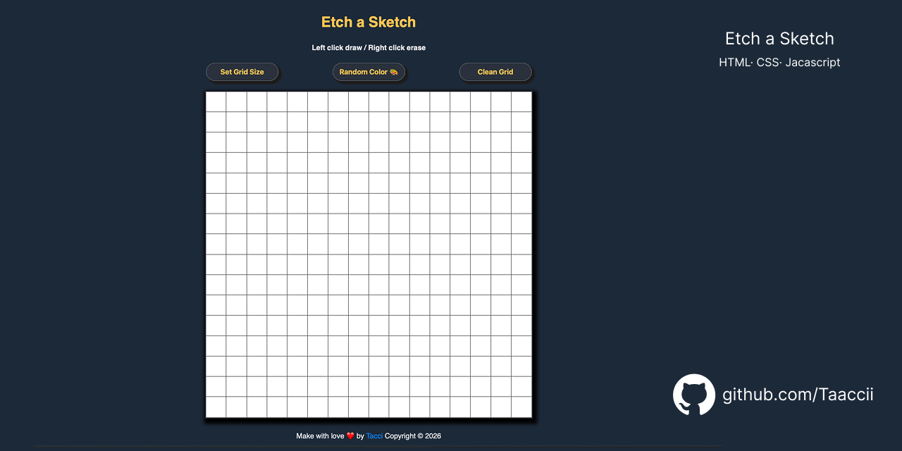

# Etch-a-Sketch

> Drawing pad interattivo con griglia dinamica e modalità colore multipla.

---

## 🔗 Live Demo

**Live Demo:** [taaccii.github.io/etch-a-sketch](https://taaccii.github.io/etch-a-sketch/)

---

## ✨ Features

- **Dynamic grid** — customizable size on every page load
- **Draw mode** — left click drag to draw
- **Erase mode** — right click to erase
- **Rainbow mode** — random color on every cell
- **Opacity mode** — progressive blending effect
- **Clean Grid** — reset the canvas instantly

---

## 🛠️ Tech Stack

| Component | Technology |
|-----------|------------|
| **Markup** | HTML5 |
| **Style** | CSS3 |
| **Logic** | JavaScript ES6+ |

---

## 💡 What I Learned

- Creating and manipulating DOM elements dynamically with JavaScript
- Handling multiple mouse events (`mouseover`, `mousedown`, `contextmenu`)
- Implementing progressive opacity blending logic
- Managing grid state and re-rendering on user input

---

## 📝 Notes

The highlight of this project was getting all the event listeners working together — drag-to-draw, single click, and right-click erase all coexisting smoothly. Implementing random colors and opacity blending pushed me to think about state in a new way. A clear sign that JavaScript's potential is just starting to reveal itself.

---

## 📄 License

This project is licensed under the **MIT License** — see [`LICENSE`](./LICENSE) for details.

---

## 👨‍💻 Author

**TacciDev**

- 📧 [taccidev@gmail.com](mailto:taccidev@gmail.com)
- 🐙 GitHub: [@Taaccii](https://github.com/Taaccii)
- 💼 LinkedIn: [alessandro-barletta-dev](https://linkedin.com/in/alessandro-barletta-dev)

---

> *Project built as part of [The Odin Project](https://www.theodinproject.com) Foundations curriculum.*